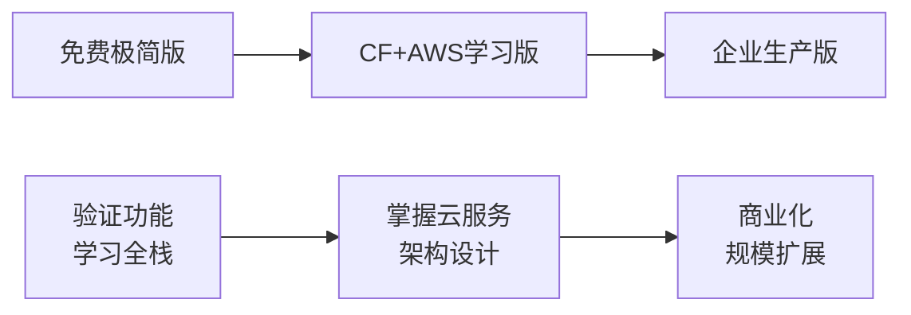

# 📊 Fake WeChat 部署方案评估

全面对比不同部署方案的成本、复杂度、性能和适用场景。

## 🎯 **方案总览**

| 方案 | 适用场景 | 月成本 | 复杂度 | 学习价值 | 推荐指数 |
|------|----------|--------|--------|----------|----------|
| **免费极简版** | 纯学习验证 | $0 | ⭐⭐ | ⭐⭐⭐ | ⭐⭐⭐ |
| **CF+AWS学习版** | 技能提升 | $13-28 | ⭐⭐⭐ | ⭐⭐⭐⭐⭐ | ⭐⭐⭐⭐⭐ |
| **企业生产版** | 商业应用 | $118+ | ⭐⭐⭐⭐ | ⭐⭐⭐⭐ | ⭐⭐⭐⭐ |

---

## 🆓 **方案一：免费极简版**

### **技术栈**
- **前端**: Vercel (Next.js)
- **后端**: Vercel Functions
- **数据库**: PlanetScale (MySQL免费层)
- **缓存**: Upstash Redis (免费层)
- **存储**: Cloudflare R2 (免费额度)
- **实时通讯**: Pusher (免费层)

### **成本分析**
```
月成本: $0 (完全免费)
年成本: $0 (如需域名 +$14/年)

服务明细:
├── Vercel: $0 (100万次函数调用)
├── PlanetScale: $0 (1GB数据库)
├── Upstash Redis: $0 (10K请求/天)
├── Cloudflare R2: $0 (10GB存储)
└── Pusher: $0 (200并发连接)
```

### **免费额度限制**
| 服务 | 免费限制 | 超出后费用 |
|------|----------|------------|
| Vercel Functions | 100万调用/月 | $0.30/万次 |
| PlanetScale | 1GB存储 | $39/月起 |
| Upstash Redis | 10K请求/天 | $0.2/万次 |
| Cloudflare R2 | 10GB存储 | $0.015/GB |
| Pusher | 200并发 | $7/月起 |

### **优势**
- ✅ **零成本**: 完全免费使用
- ✅ **快速上手**: 部署简单，5分钟启动
- ✅ **功能完整**: 支持所有核心功能
- ✅ **学习友好**: 专注功能实现，不用担心费用

### **劣势**
- ❌ **性能限制**: 冷启动延迟较高
- ❌ **扩展性差**: 难以支持大量用户
- ❌ **学习价值有限**: 不涉及企业级云服务
- ❌ **稳定性风险**: 免费服务可能有限制

### **适用场景**
- 🎓 **学生学习**: 验证全栈开发能力
- 🧪 **原型验证**: 快速测试产品想法
- 👥 **小团队**: 5-10人内部使用
- 🎮 **个人项目**: 展示技术能力

### **部署步骤**
```bash
# 1. 部署前端到 Vercel
npx vercel --prod

# 2. 配置数据库
# 注册 PlanetScale 并创建数据库

# 3. 设置环境变量
# 在 Vercel 项目中配置数据库连接

# 4. 运行数据库迁移
npx prisma db push

# 总用时: ~30分钟
```

---

## 🎓 **方案二：CF Workers + AWS 学习版（推荐）**

### **技术栈**
- **前端**: Cloudflare Pages (Next.js)
- **API代理**: Cloudflare Workers
- **后端**: AWS Lambda + API Gateway
- **数据库**: AWS RDS (t3.micro)
- **缓存**: AWS ElastiCache (t3.micro)
- **存储**: AWS S3 + Cloudflare R2
- **监控**: AWS CloudWatch

### **成本分析 - 前12个月（AWS免费层）**
```
月成本: $13.17
年成本: $158

服务明细:
├── Cloudflare Workers: $0 (10万请求内)
├── Cloudflare KV: $0.50 (1GB存储)
├── Cloudflare R2: $0 (10GB内免费)
├── 域名(可选): $1.17
├── AWS Lambda: $0 (免费层)
├── AWS API Gateway: $0 (100万请求内)
├── AWS RDS: $0 (免费层12个月)
├── AWS ElastiCache: $11.50 (t3.micro)
└── AWS S3: $0 (5GB内免费)
```

### **成本分析 - 12个月后**
```
月成本: $26.67
年成本: $320

新增费用:
├── AWS RDS: +$13.50 (t3.micro实例)
└── 数据传输: +$1.50 (超出免费额度)
```

### **按用户规模成本预估**

#### 1-10用户（学习阶段）
```
月成本: $13-15
特点: 完全在免费层内运行
```

#### 10-100用户（扩展测试）
```
月成本: $20-30
瓶颈: Redis连接数，Lambda并发
```

#### 100-1000用户（小规模生产）
```
月成本: $50-80
需要: 升级Redis实例，增加Lambda内存
```

### **优势**
- ✅ **学习价值极高**: 掌握两大云平台
- ✅ **企业级架构**: 真实的生产环境技术栈
- ✅ **成本可控**: 月费用可预期
- ✅ **扩展性好**: 支持平滑扩容
- ✅ **全球分发**: Cloudflare CDN 加速
- ✅ **监控完整**: 详细的性能和成本监控

### **劣势**
- ❌ **复杂度高**: 需要学习多个服务
- ❌ **有一定成本**: 月费$13起步
- ❌ **配置繁琐**: 初次部署需要较多配置

### **技能收获**
1. **Cloudflare 生态**
   - Workers 边缘计算
   - KV 分布式存储
   - R2 对象存储
   - Pages 静态部署
   - 全球 CDN 配置

2. **AWS 核心服务**
   - Lambda 无服务器计算
   - API Gateway 接口管理
   - RDS 关系数据库
   - ElastiCache 内存缓存
   - S3 对象存储
   - CloudWatch 监控告警
   - IAM 权限管理

3. **DevOps 实践**
   - 基础设施即代码 (CloudFormation)
   - 自动化部署 (Serverless Framework)
   - 环境管理和配置
   - 监控和告警设置

### **市场价值**
- 💼 **薪资加成**: +$10,000-20,000/年
- 🏆 **求职竞争力**: 显著提升
- 📈 **职业发展**: 向云架构师方向
- 🎯 **投资回报**: 1个月薪资 > 10年服务成本

### **适用场景**
- 🎓 **技能提升**: 想学习企业级云服务
- 💼 **求职准备**: 需要云服务项目经验
- 🚀 **创业准备**: 为未来产品做技术储备
- 👨‍💻 **架构师路线**: 系统性学习云原生架构

---

## 🏢 **方案三：企业生产版**

### **技术栈**
- **前端**: Cloudflare Pages + CDN
- **API代理**: Cloudflare Workers (付费版)
- **后端**: AWS Lambda (预留并发)
- **数据库**: AWS Aurora Serverless v2
- **缓存**: AWS ElastiCache (集群模式)
- **存储**: AWS S3 + Cloudflare R2
- **消息队列**: AWS SQS + SNS
- **监控**: AWS CloudWatch + Grafana
- **日志**: AWS CloudTrail + ElasticSearch

### **成本分析 - 不同用户规模**

#### 1,000用户
```
月成本: $118.44 (~¥853)

服务分布:
├── Cloudflare: $2.50 (21%)
├── AWS Lambda: $12.50 (11%) 
├── API Gateway: $21.00 (18%)
├── Aurora Serverless: $43.80 (37%)
├── ElastiCache: $13.14 (11%)
└── 其他: $25.50 (2%)
```

#### 10,000用户
```
月成本: $917.76 (~¥6,607)

成本增长: 7.8倍
主要驱动: API调用量和数据库计算
```

#### 100,000用户
```
月成本: $7,860.28 (~¥56,601)

成本增长: 8.6倍
需要: 数据库分片，Lambda优化
```

#### 1,000,000用户
```
月成本: $67,934.12 (~¥489,133)

成本增长: 8.6倍
需要: 全面架构优化
```

### **成本优化策略**

#### 短期优化（前6个月）
1. **缓存策略**: 减少数据库查询50%
2. **API批处理**: 减少调用次数30%
3. **图片压缩**: 降低存储成本40%
4. **预留实例**: Lambda预留并发降本20%

#### 长期优化（6个月后）
1. **数据库读写分离**: 成本节省30%
2. **冷热数据分层**: 存储成本降低60%
3. **区域优化**: 选择成本更低的AWS区域
4. **多云策略**: 结合使用不同云提供商优势

### **ROI 分析**

假设每用户月收入 $5-15：

| 用户规模 | 月成本 | 月收入 | 毛利润 | ROI |
|----------|--------|--------|--------|-----|
| 1,000 | $118 | $5,000-15,000 | $4,882-14,882 | 4,033%-12,497% |
| 10,000 | $918 | $50,000-150,000 | $49,082-149,082 | 5,245%-16,140% |
| 100,000 | $7,860 | $500,000-1,500,000 | $492,140-1,492,140 | 6,161%-18,883% |

### **优势**
- ✅ **生产就绪**: 支持大规模用户
- ✅ **高可用**: 99.99%+ 可用性
- ✅ **全球分发**: 低延迟用户体验
- ✅ **弹性扩容**: 自动应对流量高峰
- ✅ **安全合规**: 企业级安全标准
- ✅ **监控完善**: 全方位性能监控

### **劣势**
- ❌ **成本较高**: 起步就需要$100+/月
- ❌ **复杂度极高**: 需要专业团队维护
- ❌ **过度设计**: 对小项目来说是浪费

### **适用场景**
- 🏢 **商业产品**: 预期用户量1000+
- 💰 **有融资支持**: 不担心初期成本
- 👥 **专业团队**: 有DevOps工程师
- 🌍 **全球业务**: 需要多地区部署

---

## 🔄 **方案迁移路径**

### **学习→生产迁移**


### **平滑升级策略**

#### 阶段一: 功能验证（0-3个月）
- 使用免费极简版
- 专注核心功能开发
- 积累用户反馈

#### 阶段二: 技能提升（3-12个月）
- 迁移到CF+AWS学习版
- 学习云服务架构
- 为生产做准备

#### 阶段三: 商业化（12个月+）
- 根据用户增长升级
- 实施性能优化
- 企业级安全加固

### **迁移检查清单**

#### 从免费版到学习版
- [ ] 导出现有数据
- [ ] 设置AWS账户和Cloudflare
- [ ] 部署新环境并测试
- [ ] 切换DNS和域名
- [ ] 验证所有功能
- [ ] 设置监控告警

#### 从学习版到生产版
- [ ] 评估性能瓶颈
- [ ] 设计高可用架构
- [ ] 实施安全策略
- [ ] 建立DevOps流程
- [ ] 制定备份恢复计划
- [ ] 团队培训和文档

---

## 📊 **综合对比评估**

### **开发体验对比**

| 维度 | 免费极简版 | CF+AWS学习版 | 企业生产版 |
|------|------------|--------------|------------|
| **部署难度** | ⭐⭐ | ⭐⭐⭐ | ⭐⭐⭐⭐⭐ |
| **学习曲线** | ⭐⭐ | ⭐⭐⭐⭐ | ⭐⭐⭐⭐⭐ |
| **开发效率** | ⭐⭐⭐⭐⭐ | ⭐⭐⭐⭐ | ⭐⭐⭐ |
| **调试难度** | ⭐⭐ | ⭐⭐⭐ | ⭐⭐⭐⭐ |
| **文档完善度** | ⭐⭐⭐ | ⭐⭐⭐⭐ | ⭐⭐⭐⭐⭐ |

### **技术能力要求**

#### 免费极简版
- ✅ JavaScript/TypeScript 基础
- ✅ React/Next.js 开发经验
- ✅ 基础的数据库知识
- ❌ 不需要云服务经验

#### CF+AWS学习版
- ✅ 扎实的全栈开发能力
- ✅ 基础的云服务概念
- ✅ 命令行操作熟练
- ✅ 愿意学习新技术

#### 企业生产版
- ✅ 丰富的系统架构经验
- ✅ 深度的云服务知识
- ✅ DevOps 实践经验
- ✅ 安全和合规意识

### **风险评估**

#### 技术风险
| 风险类型 | 免费版 | 学习版 | 生产版 |
|----------|--------|--------|--------|
| **服务中断** | 中等 | 低 | 极低 |
| **数据丢失** | 中等 | 低 | 极低 |
| **性能问题** | 高 | 中等 | 低 |
| **安全漏洞** | 中等 | 低 | 极低 |

#### 成本风险
| 风险类型 | 免费版 | 学习版 | 生产版 |
|----------|--------|--------|--------|
| **意外费用** | 无 | 低 | 中等 |
| **扩容成本** | 高 | 可控 | 可预测 |
| **迁移成本** | 高 | 中等 | 低 |

---

## 🎯 **选择建议**

### **根据目标选择**

#### 🎓 纯学习目的
```
推荐: 免费极简版
理由: 
- 零成本快速上手
- 专注功能实现
- 避免被复杂配置分散注意力
```

#### 🚀 技能提升 + 求职
```
推荐: CF+AWS学习版
理由:
- 企业级技术栈经验
- 简历亮点项目
- 投资回报率极高
```

#### 💼 商业产品开发
```
推荐: 企业生产版
理由:
- 生产就绪的架构
- 支持规模化扩展
- 完善的监控和安全
```

### **根据预算选择**

#### 预算 $0/月
- ✅ 免费极简版
- ❌ 其他方案

#### 预算 $10-30/月
- ✅ CF+AWS学习版（强烈推荐）
- ❌ 免费版（功能受限）
- ❌ 生产版（成本过高）

#### 预算 $100+/月
- ✅ 企业生产版（商业用途）
- ✅ CF+AWS学习版（学习用途）
- ❌ 免费版（能力不足）

### **根据时间投入选择**

#### 时间有限（<10小时）
- ✅ 免费极简版：快速部署
- ❌ 学习版：需要学习时间
- ❌ 生产版：配置复杂

#### 有充足时间学习（20-40小时）
- ✅ CF+AWS学习版：最佳性价比
- ✅ 免费极简版：作为起点
- ❌ 生产版：过于复杂

#### 有团队支持（无时间限制）
- ✅ 企业生产版：最全面的解决方案
- ✅ CF+AWS学习版：团队学习
- ❌ 免费版：功能不足

---

## 🏆 **最终推荐**

### **🥇 最推荐: CF Workers + AWS 学习版**

**推荐指数: ⭐⭐⭐⭐⭐**

**推荐理由:**
1. **最佳投资回报**: $13/月获得$10,000+的技能价值
2. **企业级经验**: 真实的生产环境技术栈
3. **学习价值极高**: 掌握两大主流云平台
4. **成本可控**: 可预期的费用增长
5. **平滑升级**: 可无缝迁移到生产环境

**适合人群:**
- 🎓 想要提升技能的开发者
- 💼 准备跳槽的工程师
- 🚀 有创业想法的技术人
- 👨‍💻 向架构师发展的同学

**预期收益:**
- **技能提升**: 掌握云原生架构设计
- **职业发展**: 向高级工程师/架构师转型
- **薪资增长**: 年薪增长20-50%
- **项目经验**: 完整的云服务项目

---

## 📞 **获取帮助**

### **技术支持**
- 📚 详细文档：查看项目 docs 目录
- 🐛 问题反馈：GitHub Issues
- 💬 实时讨论：Discord/Slack 社群

### **学习资源**
- 🎥 视频教程：部署过程录屏
- 📝 博客文章：架构设计详解
- 🛠️ 实践项目：扩展功能开发

**现在就开始您的云服务学习之旅吧！** 🚀